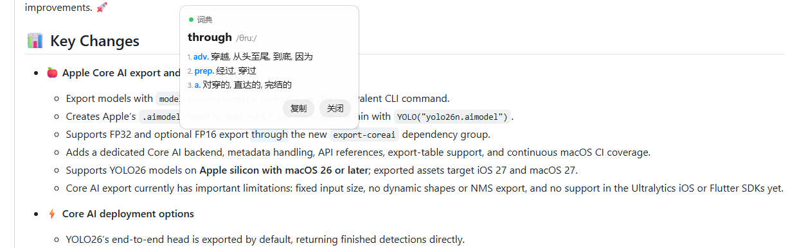
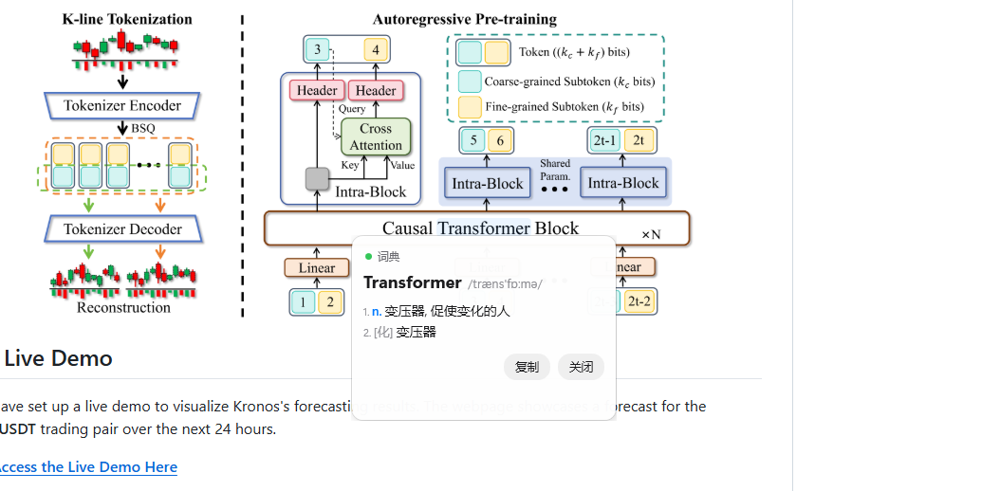
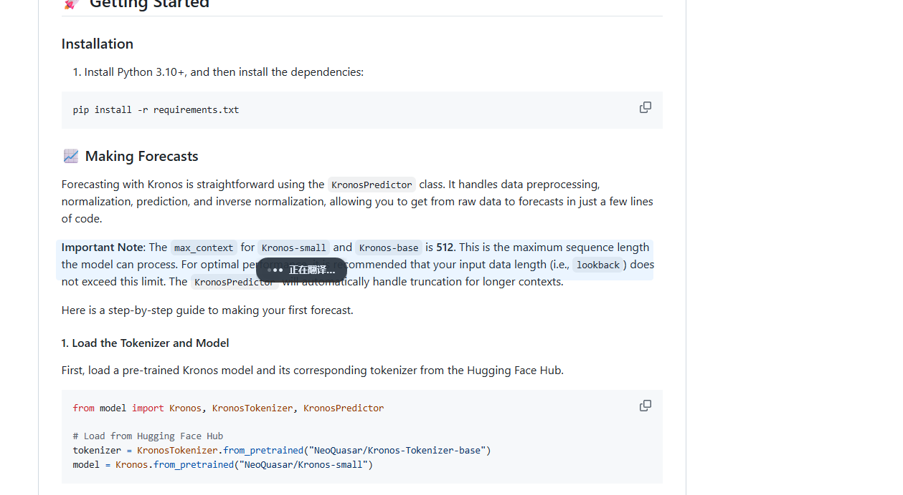
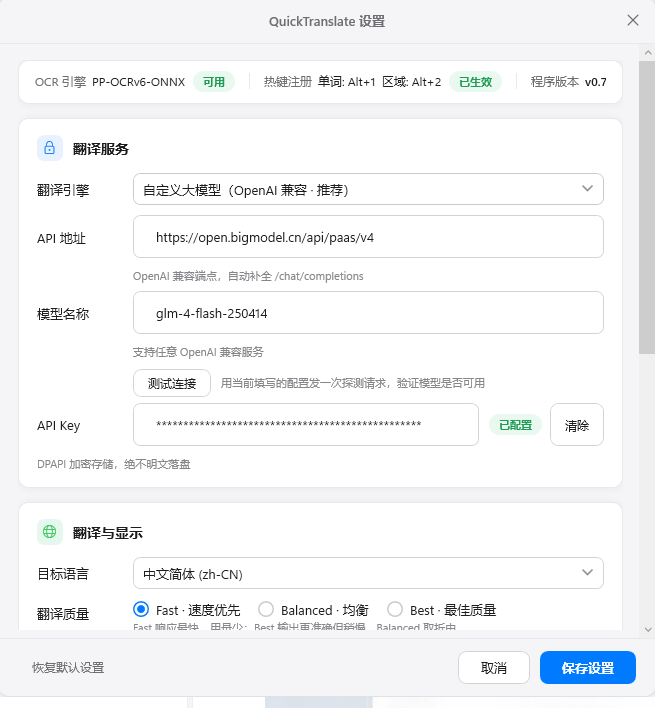
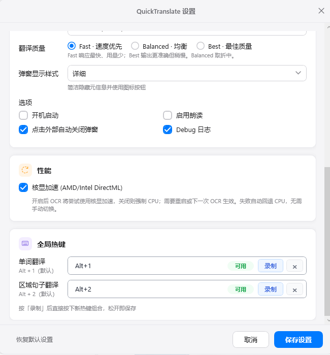
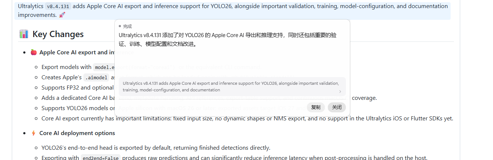

# QuickTranslate

[](https://github.com/xf2214/QuickTranslate/actions/workflows/ci.yml)
[](LICENSE)

> **Point at any text on your screen, press one hotkey, get the translation right there.**
>
> No selecting. No copying. No window switching.

[中文文档](./README.md)

---

## Sound familiar?

- 📄 Reading English papers / PDFs where the text **can't be selected or copied at all**?
- 🎞️ English in video subtitles, app UIs, or images — forced to type it out letter by letter just to look it up?
- 🔁 Copy → switch to a translator tab → paste → read → switch back… dozens of times a day, flow completely broken?
- ☁️ Using online screenshot translators while worrying that **your entire screen gets uploaded to the cloud**?

QuickTranslate's answer is a single step: **point at it, press a key.**



---

## Three hotkeys, every scenario covered

| Hotkey | Scenario | Result |
| :----: | -------- | ------ |
| **Alt + 1** | Look up a word | Compact card: IPA + part of speech + definition |
| **Alt + 2** (tap) | Translate a paragraph | Auto-detects the whole block, streams the translation |
| **Hold Alt + 2 and drag** | Translate exactly what you pick | Selection grows line by line; release to translate |
| **Esc** | — | Cancel / close all overlays |

---

## Feature tour

### 🔤 Word mode — one point per unfamiliar word

Hover over a word and press **Alt + 1**: local OCR recognizes it and a compact card pops up with IPA, part of speech, Chinese definition, and a copy button. Local-dictionary hits show a green "词典" (dictionary) badge — **zero network, millisecond latency** — so your reading rhythm is never broken.



### 📑 Block mode — whole paragraphs, streamed

Place the cursor inside a paragraph and tap **Alt + 2**: the app automatically "grows" the full block and frames it, then shows a translation card below. While the online model is working, a compact "Translating…" indicator appears, followed by **streamed output**:



Once done, the card shows the **translation on top and the OCR source text below** for side-by-side checking, with one-click copy and click-outside-to-dismiss. The popup never steals focus:



### ✋ Drag-select mode — when auto-detection guesses wrong

If the automatic paragraph detection picks the wrong range, **hold Alt + 2 and drag downward**: the dashed selection expands line by line in real time — you choose exactly which lines to include, and releasing the mouse starts the translation. Drag past the initial capture area and the OCR region expands automatically, so long paragraphs translate in one go.

### ⚙️ Settings — configure once, works forever

Open Settings from the tray menu. The top status bar shows **live OCR engine availability, hotkey registration state, and the app version**:



- **Translation service**: any OpenAI-compatible endpoint (DeepSeek / Zhipu / Moonshot / local Ollama…). Fill in the API URL + model name + key, with a one-click "Test connection" probe; the key is **DPAPI-encrypted and never written to disk in plaintext**
- **Translation & display**: target language, three quality tiers (**Fast / Balanced / Best**), popup style (detailed / compact)



- **Options**: launch at startup, read-aloud, click-outside-to-dismiss, debug logging
- **Performance**: **iGPU acceleration (AMD/Intel DirectML)** — OCR can run on the GPU for extra speed, with automatic CPU fallback, no manual switching needed
- **Global hotkeys**: press "Record" and tap a new key combo to rebind; live availability status shown

---

## Why QuickTranslate?

| | |
|:-:|---|
| ⚡ **Fast** | Keypress → selection box in ~110 ms (P50); cache hits skip the network entirely |
| 🧠 **Local OCR** | Full PP-OCRv6 pipeline runs on your machine — works offline |
| 🔒 **Real privacy** | Screenshots live only in memory and are destroyed after use; only recognized text is uploaded; keys encrypted with Windows DPAPI |
| 🧩 **Model freedom** | Not locked to any vendor — swap OpenAI-compatible endpoints at will |
| 🪶 **Lightweight** | Tray-resident, no main window; ~25 MB RAM and ~0% CPU in the background |
| 🖥️ **HiDPI-ready** | PerMonitorV2 awareness; pixel-accurate across multi-monitor 125/150/200% scaling |

---

## Getting started

### Option 1: Download and run

Grab the latest `win-x64` zip from [Releases](https://github.com/xf2214/QuickTranslate/releases), extract, and run `QuickTranslate.App.exe` — models and dictionary bundled, no .NET install required.

### Option 2: Build from source

```powershell
# Requires Windows 10/11 x64 + .NET 10 SDK
dotnet build QuickTranslate.sln
dotnet run --project src/QuickTranslate.App
```

### First run: configure your engine

Tray icon → **Settings** → Translation engine card → enter your OpenAI-compatible endpoint (Base URL / Model / API Key) → Save. Done — start pointing at text.

<details>
<summary><b>🛠️ Technical details (click to expand): how it works / tech stack / project layout</b></summary>

### How it works

```text
Hotkey (Alt+1 / Alt+2 tap / hold-and-drag)
   → Coordinators (Word / Block InteractionCoordinator)
   → Cursor-centered screenshot (physical pixels, in-memory GDI BitBlt, never persisted)
   → PP-OCRv6 ONNX recognition on-device (det → cls → rec → CTC decode)
   → Word hit-test / paragraph growth / drag-line filtering
   → Unfocused selection overlay (WS_EX_NOACTIVATE)
   → Translation routing (L1 in-memory LRU → L2 SQLite → ECDICT local dict → online provider)
   → Popup (auto-positioned + size-adaptive + SSE streaming + optional TTS)
```

### Tech stack

| Layer | Technology |
|-------|-----------|
| Language / runtime | C# / .NET 10 (`net10.0-windows`) |
| UI | WPF + Win32 P/Invoke (unfocused popups, global hotkeys, hold detection) |
| OCR | PP-OCRv6 + ONNX Runtime (session kept warm; optional DirectML iGPU acceleration with CPU fallback) |
| Cache | In-memory LRU (1000 entries) + SQLite L2 (SHA-256 indexed, WAL) |
| Dictionary | ECDICT-lite (user overlay → packed high-frequency binary) |
| Translation | `ITranslationProvider` abstraction: custom OpenAI SSE streaming / Qwen-MT |
| Key storage | Windows DPAPI CurrentUser + entropy.dat |
| Logging | Serilog leveled filtering (source text excluded by default) |
| Tests | xUnit, ~580+ cases; GitHub Actions CI (full Windows test suite) |

### Solution layout

| Project | Responsibility |
|---------|---------------|
| `src/QuickTranslate.Core` | Domain abstractions, physical/DIP geometry strong types, AppSettings |
| `src/QuickTranslate.Platform` | Win32 interop: screenshots, hotkeys, PerMonitor DPI, window styles |
| `src/QuickTranslate.Infrastructure` | OCR engine, translation providers, dictionary/cache, model downloader, DPAPI store |
| `src/QuickTranslate.App` | WPF UI, coordinators, popup positioning & size estimation |
| `src/QuickTranslate.TextToSpeech` | Windows SAPI text-to-speech |
| `benchmarks/` `tests/` | Performance benchmarks / xUnit unit & integration tests |

### Performance baseline

From [docs/benchmark-results/](docs/benchmark-results/) (Mock OCR + offline translation baseline):

| Metric | P50 | P95 |
|--------|----:|----:|
| Idle working set | ~24.8 MB | ~25.2 MB |
| Idle CPU | 0.00% | 0.10% |
| Keypress → overlay | ~110 ms | ~110 ms |
| Cache read/write | ~141 µs / ~113 µs | ~277 µs / ~138 µs |

### Privacy & security

- Screenshots exist only in memory and are released immediately after OCR — **never written to disk by default**
- Only the **recognized text** reaches the cloud — **screen images are never uploaded**
- API keys encrypted with DPAPI CurrentUser; never serialized as plaintext into any file or log
- Logs capture timing, lengths, and error codes only — no content by default

### Model assets

`assets/models/version.json` ships SHA-256 verification manifests; missing models fall back to Mock OCR automatically. One-shot download:

```powershell
.\scripts\download-v6-final.ps1
```

</details>

---

## Documentation

- [QuickTranslate_Agent_Project_Spec_v0.1.md](QuickTranslate_Agent_Project_Spec_v0.1.md) — PRD + system design + interface contracts
- [docs/ocr-models-and-custom-llm.md](docs/ocr-models-and-custom-llm.md) — OCR model provenance & custom LLM integration
- [docs/superpowers/specs/2026-08-27-block-drag-design.md](docs/superpowers/specs/2026-08-27-block-drag-design.md) — Hold-and-drag selection design doc
- [docs/benchmark-results/](docs/benchmark-results/) — Performance reports
- [docs/per-monitor-dpi-test-guide.md](docs/per-monitor-dpi-test-guide.md) — High-DPI testing checklist

## License & credits

- Code released under the [MIT License](LICENSE)
- Third-party notices in [LICENSES.txt](LICENSES.txt): PP-OCRv6 model weights (Apache-2.0), ONNX Runtime (MIT), ECDICT dictionary, .NET Runtime, xUnit, etc.
