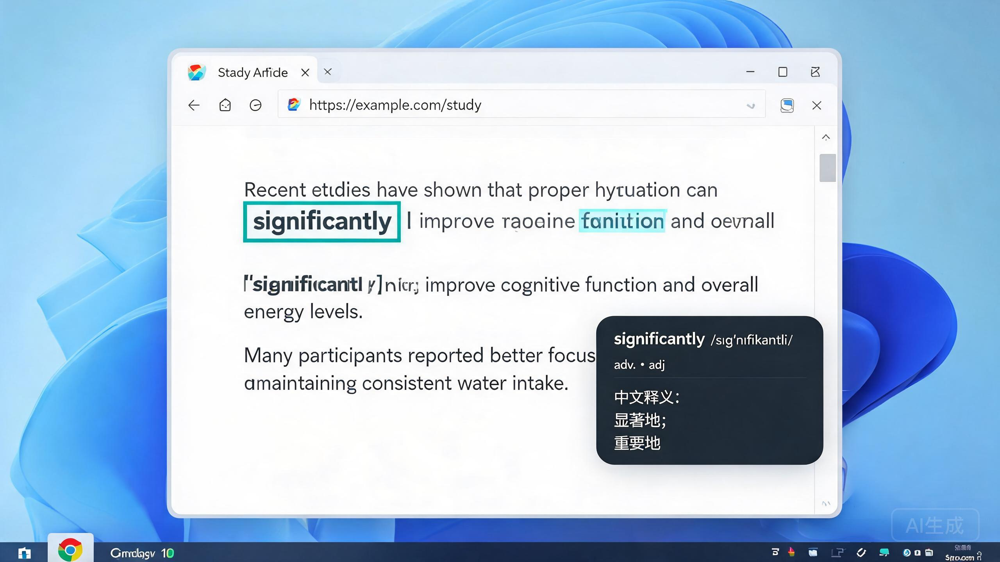
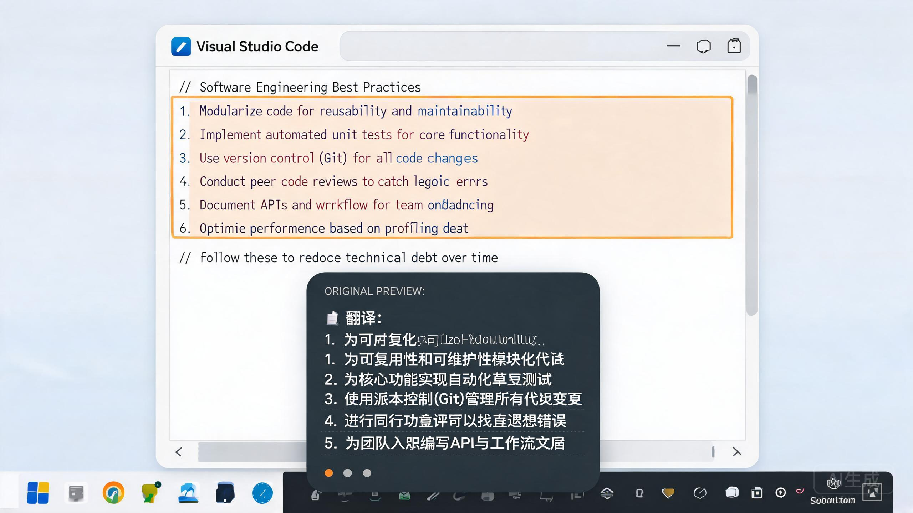
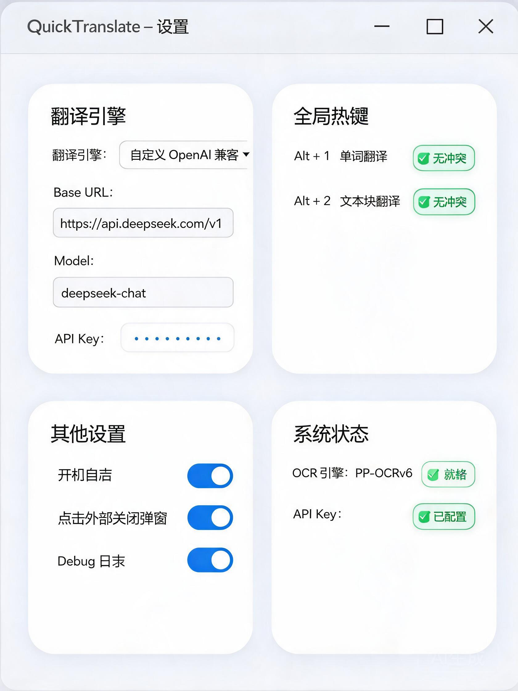

# QuickTranslate

> **Windows 快速翻译工具 · 鼠标指向屏幕文字，按快捷键即翻译。**

无需选中文本、无需复制粘贴、无需切换窗口 —— 把鼠标停在目标文字附近，按全局快捷键，QuickTranslate 就在原地识别并展示翻译结果。

```text
  ┌─ 快捷键 ────────────────────────────┐
  │  Alt + 1    单词翻译（小弹窗）       │
  │  Alt + 2    文本块翻译（流式大弹窗）  │
  │  Esc        取消当前操作并关闭浮窗    │
  └─────────────────────────────────────┘
```

[](./assets/screenshots/word-mode-demo.jpg)

<sub>↑ 把鼠标指向 "significantly"，按 **Alt+1** — OCR 在本地完成，青色框标出所选单词，弹窗即时显示音标、词性与中文释义，完全不打断当前工作流。</sub>

---

## 核心能力

| 能力 | 说明 |
|:---:|------|
| 🎯 **指哪译哪** | 鼠标 → OCR → 框选 → 翻译，不打断当前应用焦点 |
| ⚡ **极速响应** | Hotkey → Overlay P50 < 180ms；多级缓存命中即不发网络请求 |
| 🧠 **本地 OCR** | PP-OCRv6 全链路（det → cls → rec → CTC 解码）在本机推理 |
| 🔒 **隐私优先** | 截图只存在内存、永不落盘上传；Key 用 DPAPI 加密存储 |
| 🧩 **灵活模型** | 默认接入任意 OpenAI 兼容端点（SSE 流式），也可切回 Qwen-MT |
| 🖥️ **高 DPI 适配** | PerMonitorV2 感知，多显示器、125/150/200% 缩放定位准确 |
| 🎙️ **朗读** | 集成 Windows SAPI，一键朗读译文 |
| 📦 **托盘常驻** | 无主窗口，后台 < 0.5% CPU、~25 MB 工作集常驻 |

---

## 效果演示

### 1 · 单词模式 Alt+1

鼠标悬停在任意英文单词上，按下 **Alt + 1**，程序以鼠标为中心按需截取小范围 → PP-OCRv6 本地识别 → 青色选择框锁定目标词 → 弹出**小而紧凑的词义卡片**（音标 + 词性 + 中文释义 + 复制按钮），卡片自动避开原文并夹紧显示器边界。

优先顺序：内存 LRU 缓存 → SQLite L2 → ECDICT-lite 本地词典 → 在线大模型。常用词几乎零网络。

[](./assets/screenshots/word-mode-demo.jpg)

---

### 2 · 文本块模式 Alt+2

把鼠标放在任意段落中，按 **Alt + 2**，程序对鼠标所在 OCR 行做 Anchor（锚点），按「行高 / 垂直间距 / 左对齐 / 横向重叠」的启发式规则向上+向下生长，**合并为一段意图文本块**；琥珀色半透明选择框覆盖所选行，随后在框下弹出**中等尺寸的翻译卡片**，支持：

- 顶部 3 行 OCR 原文预览（用于核对识别范围）
- **SSE 流式译文**（在线模式下文字逐段出现，TTFT < 700ms 目标）
- 弹窗按文本量自动估算尺寸、支持滚动
- 复制译文、朗读、关闭按钮

[](./assets/screenshots/block-mode-demo.jpg)

---

### 3 · 设置窗口

从托盘右键菜单「设置」打开，**四张卡片式布局**，实时状态徽标：

- **翻译引擎**：下拉选「自定义 OpenAI 兼容 / Qwen-MT」；填入 Base URL、Model、API Key，保存后**即时生效无需重启**。示例：DeepSeek / Moonshot / 本地 Ollama / one-api 等全部可用。
- **全局热键**：可重新录制；保存前自动检测与系统/自身冲突；绿色徽标「✔ 无冲突」。
- **其他设置**：开机自启（HKCU Run，用户级，无需管理员）、点击外部关闭弹窗、Debug 日志开关。
- **系统状态**：OCR 引擎（PP-OCRv6 就绪 / Mock 回退）、API Key 是否已配置的实时徽标。

[](./assets/screenshots/settings-window-demo.jpg)

---

## 工作原理

```
热键 (Alt+1 / Alt+2)
   → 协调器 WordInteractionCoordinator / BlockInteractionCoordinator
   → 以鼠标为中心按需截屏（物理像素，仅内存 GDI BitBlt，不落盘）
   → IOcrEngine.RecognizeAsync —— PP-OCRv6 ONNX：det → cls → rec → CTC 解码
   → Word / Block 选择（屏幕坐标命中 + 几何块生长）
   → SelectionOverlay 无焦点识别框（WS_EX_NOACTIVATE）
   → ITranslationRouter（L1 内存 LRU → L2 SQLite → ECDICT 词典 → 在线 Provider）
   → ITranslationProvider（自定义 OpenAI SSE 流式 / Qwen-MT）
   → WordPopup / BlockPopup（自动定位 + 尺寸自适应 + 可选 TTS 朗读）
```

## 技术栈

| 层 | 技术 |
|----|------|
| 语言 / 运行时 | C# / .NET 10 (`net10.0-windows`) |
| UI | WPF + Win32 P/Invoke（`WS_EX_NOACTIVATE` 无焦点弹窗） |
| OCR | PP-OCRv6 + ONNX Runtime（CPU，Session 常驻并启动后后台预热） |
| 截图 | GDI BitBlt，内存 Bitmap Buffer，默认不落盘 |
| 缓存 | 内存 LRU (1000 项) + SQLite L2 (SHA-256 索引 + hit 统计) |
| 词典 | ECDICT-lite（packed 二进制 → 用户自定义 overlay → 59 词 stub 兜底） |
| 翻译 | `ITranslationProvider` 抽象 + Dispatcher：默认自定义 OpenAI SSE 流式 / 可选 Qwen-MT |
| 密钥 | Windows DPAPI CurrentUser + entropy.dat |
| 日志 | Serilog + 分级过滤（默认不含原文，Debug 开关可临时开启） |
| 朗读 | Windows SAPI（`QuickTranslate.TextToSpeech`） |
| 测试 | xUnit，约 370 条用例覆盖坐标/选择/取消竞态/DPI/OCR/缓存/Provider |
| 打包 | win-x64 publish profile，模型/词典按存在条件性随包复制 |

## 解决方案结构

| 项目 | 职责 |
|------|------|
| `src/QuickTranslate.Core` | 领域抽象（OCR / 翻译 / 选择 / 缓存 接口）、物理/DIP 几何强类型、AppSettings |
| `src/QuickTranslate.Platform` | Win32 互操作：GDI 截屏、全局热键、PerMonitor DPI、窗口样式 |
| `src/QuickTranslate.Infrastructure` | PP-OCRv6 引擎、翻译 Provider、词典/缓存、SettingsManager、ModelDownloader、DPAPI 存储 |
| `src/QuickTranslate.App` | WPF UI（浮窗 / 遮罩 / 加载指示器 / 设置窗口）、Word & Block 协调器、弹窗定位与尺寸估算 |
| `src/QuickTranslate.TextToSpeech` | Windows SAPI 朗读 |
| `benchmarks/QuickTranslate.Benchmarks` | 性能基准控制台（采样数据见 `docs/benchmark-results/`） |
| `tests/QuickTranslate.Tests` | xUnit 单元/集成测试 |

## 翻译流水线

```
Word 模式                            Block 模式
  │                                     │
  ├→ L1 内存 LRU 命中? ──是→结束        ├→ L1 / L2 翻译缓存命中? ──是→结束
  │ miss                                │ miss
  ├→ L2 SQLite 持久缓存 (跨启动)        └→ 在线 Provider
  │ miss                                   ├→ 自定义 OpenAI (SSE 流式, 默认)
  ├→ ECDICT 本地词典 (Word 专用)          └→ Qwen-MT (可选, 非流式)
  │ miss / 需上下文
  └→ 在线 Provider (带 OCR 行上下文作消歧)
```

## 隐私与安全

| 项 | 策略 |
|----|------|
| 屏幕截图 | 仅存于内存 `Bitmap`，OCR 完成后立即 `Dispose`，**默认不保存任何文件** |
| 上传 | 云端只接收 OCR 识别后的**文本**与必要上下文行，**不发送屏幕图像** |
| API Key | 使用 Windows **DPAPI CurrentUser** 加密 + 随机器 entropy.dat，**绝不明文**写入 JSON/日志/源码 |
| 日志 | 默认只记录耗时、长度、错误码等非内容指标；Debug 开关才允许更多技术上下文 |
| 单实例 | 启动时 `Mutex` 防多开，避免多个快捷键管线冲突 |

## 性能基准

来自 [docs/benchmark-results/cc0c3cb-1786438643301.md](docs/benchmark-results/cc0c3cb-1786438643301.md)（手工采集，OCR 用 Mock、翻译离线；端到端请以真机为准）：

| 指标 | P50 | P95 |
|------|----:|----:|
| Idle Working Set | ~24.8 MB | ~25.2 MB |
| Idle CPU | 0.00% | 0.10% |
| Hotkey → Overlay | ~110 ms | ~110 ms |
| WordSelector | ~32 µs | ~3048 µs |
| Cancel Latency | ~33 µs | ~328 µs |
| SqliteCache Add/Get | ~6.4 ms | ~6.8 ms |

---

## 开始使用

### 环境要求

- Windows 10 / 11 (x64)
- .NET 10 SDK
- OCR 模型资产（det/cls/rec 的 ONNX + `ppocr_keys.txt`），默认放入 `assets/models/`；缺失可使用下载脚本或在设置中触发下载

### 构建

```powershell
dotnet build QuickTranslate.sln
```

### 运行

```powershell
dotnet run --project src/QuickTranslate.App
```

启动后托盘常驻：**Alt+1** 单词翻译，**Alt+2** 文本块翻译，**Esc** 取消。

### 模型资产（新装机）

仓库已附带版本校验清单 `assets/models/version.json`。第一次构建/运行若检测不到 det/rec ONNX，会自动回退 Mock OCR 以便调试；正式使用请运行：

```powershell
# 从 HoVDuc GitHub Release 下载 PP-OCRv6 det/rec zip，按 inference.yml 自动生成 ppocr_keys.txt
.\scripts\download-v6-final.ps1
```

> 字典长度 vs rec 输出类别数必须严格匹配（18710 = blank + 18708 chars + space），`ModelVersionVerifier` 会在启动时对每个模型文件做 SHA256 校验，失败会记录 Warning 并触发 Mock 回退。

### 测试

```powershell
# 全量（约 370 条）
dotnet test tests/QuickTranslate.Tests/QuickTranslate.Tests.csproj

# 仅真实模型识别回归（需要 assets/models 下有模型；无模型自动跳过）
dotnet test tests/QuickTranslate.Tests/QuickTranslate.Tests.csproj --filter "FullyQualifiedName~RealOcrRecognitionTests"
```

### 发布（win-x64）

```powershell
dotnet publish src/QuickTranslate.App -c Release -r win-x64 --self-contained true -o ./artifacts/publish
```

---

## 文档

- [QuickTranslate_Agent_Project_Spec_v0.1.md](QuickTranslate_Agent_Project_Spec_v0.1.md) — PRD + 系统设计 + 接口契约 + 验收标准（里程碑 M0–M7）
- [docs/handoff-20260817.md](docs/handoff-20260817.md) — 最近一轮功能迭代（OCR 乱码根因修复 / 自定义 LLM 接入 / 加载动画 / 自适应弹窗）
- [docs/ocr-models-and-custom-llm.md](docs/ocr-models-and-custom-llm.md) — OCR 模型来源与自定义大模型接入说明
- [docs/benchmark-results/](docs/benchmark-results/) — 性能基准报告
- [docs/per-monitor-dpi-test-guide.md](docs/per-monitor-dpi-test-guide.md) — 多显示器 / 高 DPI 测试指引

## 许可与致谢

- 本仓库代码按 [MIT License](LICENSE) 开源。
- 第三方组件许可清单见 [LICENSES.txt](LICENSES.txt)，涵盖：PP-OCRv6 模型权重 (Apache-2.0)、ONNX Runtime (MIT)、ECDICT 词典、.NET Runtime、xUnit 等。
- 演示图片为产品效果示意（AI 生成风格化截图），实际界面以运行为准。
