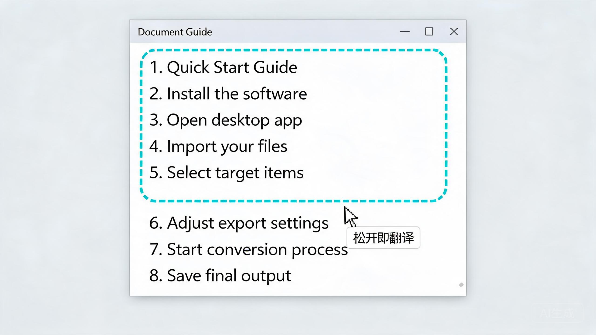
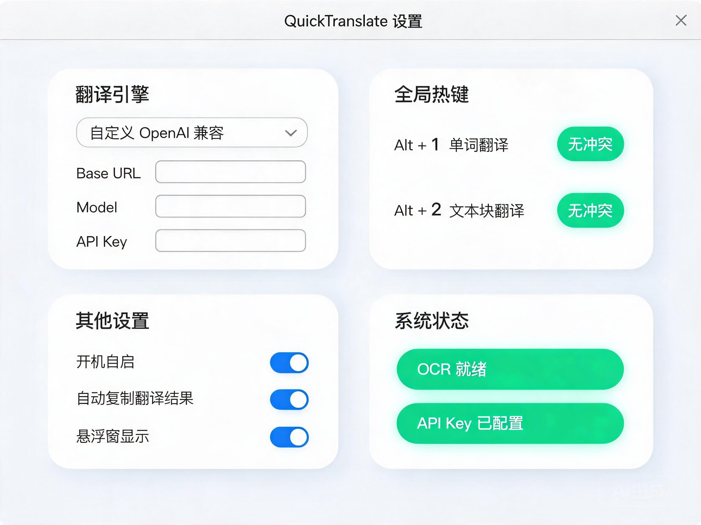

# QuickTranslate

[](https://github.com/xf2214/QuickTranslate/actions/workflows/ci.yml)
[](LICENSE)

> **鼠标指向屏幕上的任何文字，按一下快捷键，原地出翻译。**
>
> 不选中、不复制、不切窗口。

[English](./README.en.md)

***

## 你是否也遇到过？

- 📄 看英文论文 / PDF，文字**根本选不中、复制不了**？

- 🎞️ 视频字幕、软件界面、图片里的英文，只能一个字母一个字母手敲去查？

- 🔁 复制 → 切到翻译网页 → 粘贴 → 看结果 → 切回来…… 一天重复几十次，思路全断？

- ☁️ 用在线截图翻译，又担心**整个屏幕内容被上传到云端**？

QuickTranslate 的解法只有一步：**鼠标指上去，按一下。**


***

## 三个快捷键，覆盖所有场景

|        快捷键        | 场景   | 效果               |
| :---------------: | ---- | ---------------- |
|    **Alt + 1**    | 查单词  | 小卡片：音标 + 词性 + 释义 |
|  **Alt + 2**（点按）  | 翻段落  | 自动识别整段，流式输出译文    |
| **长按 Alt + 2 拖动** | 选哪翻哪 | 手动框选任意行范围，松开即翻   |
|      **Esc**      | —    | 取消操作 / 关闭浮窗      |

***

## 功能一览

### 🔤 单词模式 —— 读文献时的生词，指一下就够

鼠标悬停在单词上按 **Alt + 1**，本地 OCR 识别后弹出小卡片：音标、词性、中文释义、复制按钮。常用词走本地词典与缓存，**零网络、毫秒级响应**，完全不打断阅读节奏。


### 📑 文本块模式 —— 整段翻译，流式呈现

把鼠标放在段落里按 **Alt + 2**，程序自动把整段「生长」出来并框选，下方弹出译文卡片：**SSE 流式逐段输出**、顶部原文预览可核对、支持一键复制与朗读。弹窗不抢焦点，看完点别处自动消失。


### ✋ 拖选模式 —— 自动选不准？范围自己定

自动段落识别不合心意时，**长按 Alt + 2 向下拖**：虚线选区随鼠标逐行实时扩展，想选几行选几行，松开即翻译。超出初始截屏范围会自动扩大识别区域，长段落也能一次翻完。



### ⚙️ 设置窗口 —— 一次配置，永久生效

托盘右键打开设置，四张卡片一目了然：

- **翻译引擎**：任意 OpenAI 兼容端点（DeepSeek / Moonshot / 本地 Ollama / one-api…），填 Base URL + Model + Key，**保存即生效，无需重启**

- **全局热键**：可自由改键，保存前自动检测冲突

- **其他**：开机自启、点击外部关弹窗、Debug 日志

- **系统状态**：OCR 引擎与 API Key 就绪状态实时可见



***

## 为什么是 QuickTranslate？

|     <br />    | <br />                                        |
| :-----------: | --------------------------------------------- |
|    ⚡ **快**    | 按键到出框 P50 ≈ 110ms；多级缓存命中时零网络请求                |
| 🧠 **本地 OCR** | PP-OCRv6 全链路在本机推理，离线也能识别                      |
|   🔒 **真隐私**  | 截图只在内存、用完即毁；只上传识别出的文字；Key 用 Windows DPAPI 加密  |
|  🧩 **模型自由**  | 不被任何厂商绑定，OpenAI 兼容端点随便换                       |
|   🪶 **轻量**   | 无主窗口托盘常驻，后台 \~25MB 内存、CPU ≈ 0                 |
| 🖥️ **高分屏友好** | PerMonitorV2，多显示器 / 125% / 150% / 200% 缩放定位精准 |

***

## 快速开始

### 方式一：下载即用

到 [Releases](https://github.com/xf2214/QuickTranslate/releases) 下载最新 `win-x64` 压缩包，解压运行 `QuickTranslate.App.exe` 即可（自带模型与词典，无需安装 .NET）。

### 方式二：源码构建

```powershell
# 需要 Windows 10/11 x64 + .NET 10 SDK
dotnet build QuickTranslate.sln
dotnet run --project src/QuickTranslate.App
```

### 首次使用：配置翻译引擎

托盘右键 → **设置** → 翻译引擎卡片 → 填入你的 OpenAI 兼容端点（Base URL / Model / API Key）→ 保存。完成，开始指哪译哪。

<details>
<summary><b>🛠️ 技术细节（点击展开）：工作原理 / 技术栈 / 项目结构</b></summary>

### 工作原理

```text
热键 (Alt+1 / Alt+2 点按 / 长按拖动)
   → 协调器（Word / Block InteractionCoordinator）
   → 以鼠标为中心截屏（物理像素，仅内存 GDI BitBlt，不落盘）
   → PP-OCRv6 ONNX 本地识别（det → cls → rec → CTC 解码）
   → 单词命中 / 段落生长 / 拖动行过滤
   → 无焦点选择框（WS_EX_NOACTIVATE）
   → 翻译路由（L1 内存 LRU → L2 SQLite → ECDICT 本地词典 → 在线 Provider）
   → 弹窗展示（自动定位 + 尺寸自适应 + SSE 流式 + 可选朗读）
```

### 技术栈

| 层        | 技术                                                    |
| -------- | ----------------------------------------------------- |
| 语言 / 运行时 | C# / .NET 10 (`net10.0-windows`)                      |
| UI       | WPF + Win32 P/Invoke（无焦点弹窗、全局热键、长按检测）                 |
| OCR      | PP-OCRv6 + ONNX Runtime（CPU，Session 常驻预热）             |
| 缓存       | 内存 LRU (1000 项) + SQLite L2（SHA-256 索引，WAL）           |
| 词典       | ECDICT-lite（用户自定义 overlay → packed 高频词二进制）            |
| 翻译       | `ITranslationProvider` 抽象：自定义 OpenAI SSE 流式 / Qwen-MT |
| 密钥       | Windows DPAPI CurrentUser + entropy.dat               |
| 日志       | Serilog 分级过滤（默认不记录原文）                                 |
| 测试       | xUnit，约 580+ 用例；GitHub Actions CI（Windows 全量测试）       |

### 解决方案结构

| 项目                                  | 职责                                     |
| ----------------------------------- | -------------------------------------- |
| `src/QuickTranslate.Core`           | 领域抽象、物理/DIP 几何强类型、AppSettings          |
| `src/QuickTranslate.Platform`       | Win32 互操作：截屏、热键、PerMonitor DPI、窗口样式    |
| `src/QuickTranslate.Infrastructure` | OCR 引擎、翻译 Provider、词典/缓存、模型下载、DPAPI 存储 |
| `src/QuickTranslate.App`            | WPF UI、协调器、弹窗定位与尺寸估算                   |
| `src/QuickTranslate.TextToSpeech`   | Windows SAPI 朗读                        |
| `benchmarks/` `tests/`              | 性能基准 / xUnit 单元与集成测试                   |

### 性能基准

来自 [docs/benchmark-results/](docs/benchmark-results/)（Mock OCR + 离线翻译基线）：

| 指标       |                 P50 |                 P95 |
| -------- | ------------------: | ------------------: |
| 空闲内存     |           \~24.8 MB |           \~25.2 MB |
| 空闲 CPU   |               0.00% |               0.10% |
| 按键 → 选择框 |            \~110 ms |            \~110 ms |
| 缓存读写     | \~141 µs / \~113 µs | \~277 µs / \~138 µs |

### 隐私与安全

- 截图仅存于内存，OCR 完成立即释放，**默认不落盘**

- 云端只接收识别后的**文本**，**绝不发送屏幕图像**

- API Key 使用 DPAPI CurrentUser 加密，绝不明文写入任何文件/日志

- 日志默认只含耗时、长度、错误码等非内容指标

### 模型资产

`assets/models/version.json` 内置 SHA-256 校验清单；缺失模型时自动回退 Mock OCR。一键下载：

```powershell
.\scripts\download-v6-final.ps1
```

</details>

***

## 文档

- [QuickTranslate\_Agent\_Project\_Spec\_v0.1.md](QuickTranslate_Agent_Project_Spec_v0.1.md) — PRD + 系统设计 + 接口契约

- [docs/ocr-models-and-custom-llm.md](docs/ocr-models-and-custom-llm.md) — OCR 模型来源与自定义大模型接入

- [docs/superpowers/specs/2026-08-27-block-drag-design.md](docs/superpowers/specs/2026-08-27-block-drag-design.md) — 长按拖选设计稿

- [docs/benchmark-results/](docs/benchmark-results/) — 性能基准报告

- [docs/per-monitor-dpi-test-guide.md](docs/per-monitor-dpi-test-guide.md) — 高 DPI 测试指引

## 许可与致谢

- 本仓库代码按 [MIT License](LICENSE) 开源

- 第三方组件许可见 [LICENSES.txt](LICENSES.txt)：PP-OCRv6 模型权重 (Apache-2.0)、ONNX Runtime (MIT)、ECDICT 词典、.NET Runtime、xUnit 等

- README 演示图为产品效果示意，实际界面以运行为准

